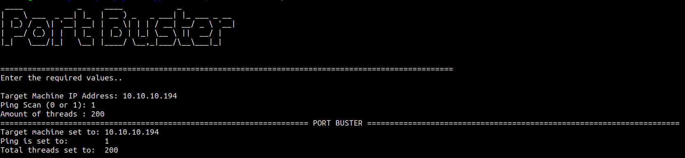

# PORTBUSTER

### Multithreader Port Scanner with automated ping scan and nmap scan

#### Update 1: Nmap integration done
#### Update 2: Docker integration (WIP)

#### Requirements: pingparsing, pyfiglet

`pip3 install -r requirements.txt`

#### Docker
*In the portBuster directory*

`docker build --tag port-buster .`

`docker run -it port-buster`

