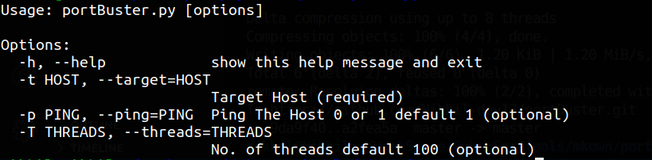

# PORTBUSTER (WIP)

### Multithreader Port Scanner with automated ping scan

#### Requirements: pingparsing

`pip3 install pingparsing`

**Usage**

```
python3 portBuster.py -t <TARGET_MACHINE_IP> -p <Boolean for ping scans> -T <No. of threads>
```


